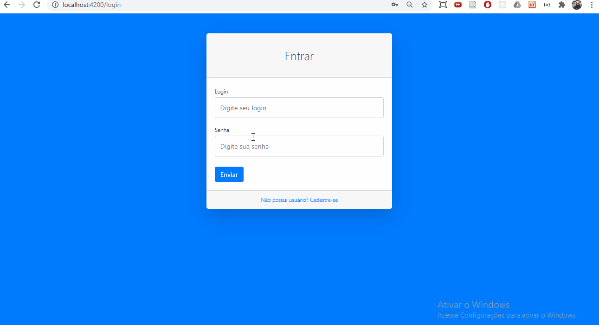
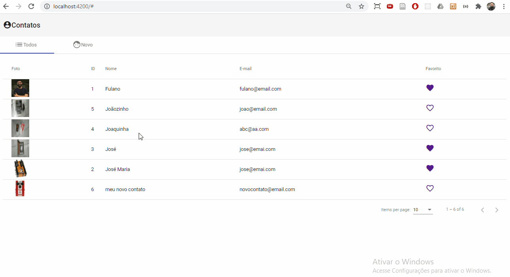

# Angular 9 + Spring Boot 2.2: Fullstack Completo

Descrição: Desenvolva 2 aplicações completas através da integração da stack Angular e Spring Boot.

Link: https://www.udemy.com/share/102a8mAEQdcFtQQng=/

## 💻 Projetos do curso

Projeto 1 - Meus Clientes: Sistema para cadastro de serviços prestados e seus respectivos clientes envolvendo autenticação e cadastro de usuários.

Projeto 2 - Contatos: Sistema para cadastro e gerenciamento de uma lista de contatos com upload de foto.
Engloba uma APIs construídas com Spring Boot e aplicações clientes desenvolvidas com Angular.

## :camera: Demonstração

## :rocket: Conceitos e tecnologias

✔️ Spring Boot 2

✔️ REST e RestFUL API

✔️ Tratamento de erros com RestControllerAdvice e ExceptionHandler

✔️ Configuração de CORS (Cross-origin Resource Sharing)

✔️ Validação com Bean Validation

✔️ DTO (Data Transfer Object)

✔️ Lombok

✔️ Configuração de internacionalização

✔️ OAuth2 e Token JWT com Spring Security

✔️ Configuração do Resource Server e Authorization Server

✔️ Upload de Arquivos e Paginação

✔️ Spring Data JPA

✔️ Banco de dados H2Database e PostgreSQL

✔️ Testes de APIs com Postman

✔️ Gerenciamento de dependências com Maven

✔️ Angular 9

✔️ Angular CLI

✔️ Angular Material

✔️ Git e GitHub

## :phone: Contato

 Linkedin [https://www.linkedin.com/in/danyllo-valente-da-silva-3569b460](https://www.linkedin.com/in/danyllo-valente-da-silva-3569b460)

:postbox: E-mail [danyllo.dvs@gmail.com](danyllo.dvs@gmail.com)
